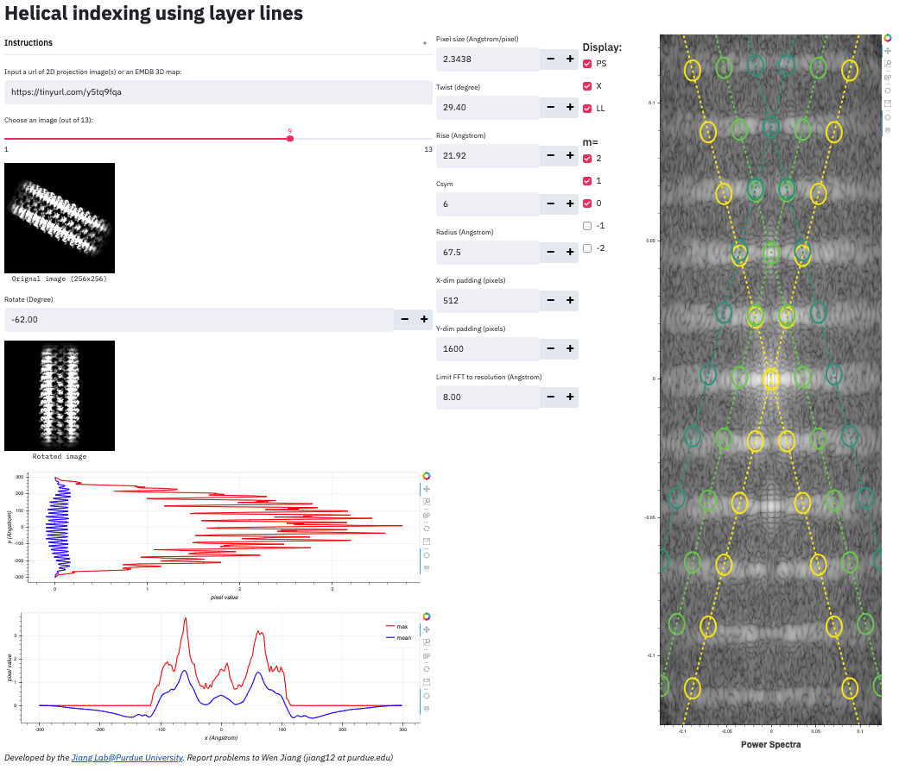

# HILL: <em>H</em>elical <em>I</em>ndexing using <em>L</em>ayer <em>L</em>ines
**HILL** is a Web app that allows the user to interactively index the parameters (twist, rise, csym) of a helical structure. It matches the layer lines expected for the candidate parameters (twist, rise, csym) to the layer lines in the power spectra of a projection image of the helical structure. 

No software installation is needed. Just click one of the hosting links (<a href="https://helical-indexing-layerlines.herokuapp.com">Host 1</a> | <a href="https://share.streamlit.io/wjiang/hill/main">Host 2</a>) to index your helical structure!</a>

